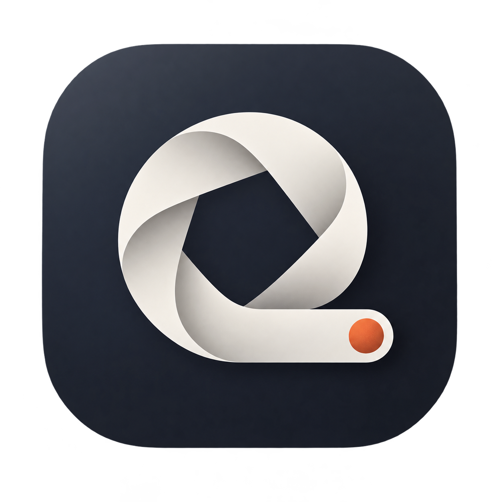
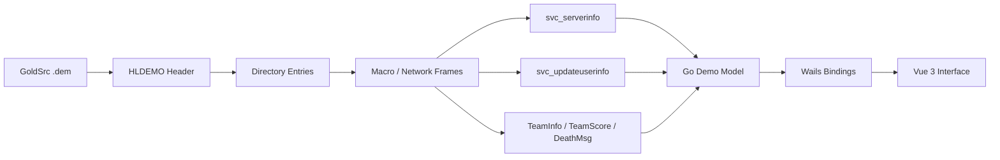

<p align="center">
  
</p>

<h1 align="center">DemoScope</h1>

<p align="center">
  一个专注于 Counter-Strike 1.6 的 GoldSrc Demo 桌面分析器。
  <br>
  支持 POV 与 HLTV Demo，所有解析均在本机完成。
</p>

## 项目定位

DemoScope 用来读取 Counter-Strike 1.6 的 `.dem` 文件并整理其中的比赛数据。它不是回放播放器，不渲染游戏画面；它更像一份可筛选的 Demo 报告，适合快速查看玩家、击杀、回合比分和底层文件信息。

应用使用系统文件选择器打开 Demo，Go 解析器读取 GoldSrc 二进制数据，再通过 Wails 将结构化结果交给 Vue 界面展示。Demo 不会上传到服务器。

## 主要功能

- 自动识别 POV Demo 与 HLTV Demo
- 展示地图、服务器、协议、时长、帧数、文件大小和录制时间提示
- 提取玩家名称、曾用名、SteamID64、模型、slot、User ID 和队伍变化
- 在玩家统计页按原 SteamID64 选择玩家，修改游戏内名称和 SteamID64 并另存为新 Demo
- 多选玩家并一次性添加自定义名称前缀，保留各自 SteamID64 和历史曾用名
- 玩家统计按 T、CT、SPEC / 未分配分组，并在各组内按真实击杀排序
- 击杀记录展示时间点、帧号、击杀者、受害者、武器和爆头类型
- 按击杀者和受害者筛选击杀记录
- 根据 `TeamScore` 将击杀按回合分组，并展示胜方、比分和回合时间范围
- 展示独立的回合比分列表与 Demo Directory entries
- 支持浅色 / 深色主题，并记住上次选择
- macOS 与 Windows 应用图标及界面品牌资源保持一致

## 界面内容

| 页面 | 内容 |
| --- | --- |
| 总览 | Demo 摘要、POV 玩家或 HLTV 信息、关键数字、玩家排行和最近击杀 |
| 玩家统计 | 按 T / CT / SPEC 分组的真实击杀、死亡、K/D、爆头和 SteamID64 |
| 击杀记录 | 按回合排列的完整击杀时间线，以及击杀者 / 受害者筛选 |
| 回合比分 | 根据比分消息推导的回合、胜方、比分、时间范围和击杀数 |
| Demo 信息 | HLDEMO 文件头、服务器元数据和 Directory entries |

主题选择保存在嵌入式 WebView 的 `localStorage` 中，键名为 `demoscope-theme`。页面会在 Vue 启动前恢复主题，避免深色模式启动时出现明显的白色闪屏。

## 修改玩家身份信息

打开 Demo 后进入“玩家统计”，在“修改玩家信息”区域选择原玩家的 SteamID64，填写新的游戏内名称和 SteamID64，再点击“另存修改后的 Demo”。新文件默认命名为 `原文件名_edited.dem`；原文件保持不变，应用会重新解析新文件并展示结果。

写回会替换该 SteamID64 对应的所有 `svc_updateuserinfo` 消息中的 `name` 与 `*sid`，并修正变长网络块、分段长度及 Directory 偏移。新名称最多 31 个 UTF-8 字节，新 SteamID64 必须是 17 位数字。数字 `User ID`、已有击杀与比分数据不会被修改。

如果只想加前缀，在同一页面勾选一名或多名玩家、输入自定义前缀，再点击加前缀按钮。该操作会在一次另存中给所有勾选玩家每次 `userinfo` 更新中的名称加前缀，保留各自的 SteamID64 和不同时间使用的名称。已带有同一前缀的名称不会重复添加；加前缀后的每个名称都须不超过 31 字节。

## 统计口径

这是使用 DemoScope 时最重要的一组定义：

| 数据 | 来源 | 说明 |
| --- | --- | --- |
| 击杀 | `DeathMsg` | 逐条累计的真实击杀事件，不是记分板的 frag / score |
| 死亡 | `DeathMsg` | 每条事件为受害者累计一次死亡，包括 WORLD / 环境伤害 |
| 爆头 | `DeathMsg` | 使用消息中的 headshot 标记 |
| 队伍 | `TeamInfo` | 随时间更新；最终统计采用已识别到的最新有效队伍 |
| 比分 | `TeamScore` | 记录 CT 与 T 的比分变化 |
| 回合 | `TeamScore` + `DeathMsg` | 一次有效比分增加视为一个回合结束，并收集该时间段内的击杀 |
| 时间 | Demo 网络帧 | 从 Demo `Playback` 段开始计算，不是现实世界时间 |
| 录制时间提示 | 文件名 | 仅识别 `(CT|T)_地图_YYYY.MM.DD-HH.MM.SS.dem`，不包含时区 |

安装、引爆或拆除 C4 等目标行为产生的奖励分不会生成 `DeathMsg`，因此不会增加“真实击杀”。这也是 DemoScope 的击杀数可能与游戏记分板分数不同的原因。

如果某条击杀无法归入由 `TeamScore` 推导出的区间，界面会将它放在“回合外事件”中，而不会丢弃。

## POV Demo 与 HLTV Demo

| 对比项 | POV Demo | HLTV Demo |
| --- | --- | --- |
| 录制来源 | 某个玩家客户端 | HLTV 广播代理 |
| 识别方式 | 未发现 HLTV 代理，并尝试根据 `svc_serverinfo` 的 client slot 标记 POV 玩家 | `svc_updateuserinfo` 中出现 `*hltv\1` |
| 视角含义 | 以录制玩家为中心 | 无单一玩家 POV，面向整场比赛 |
| 可用信息 | 取决于客户端实际收到并写入 Demo 的消息 | 通常包含更完整的全场玩家与事件消息 |
| 特殊处理 | 第二节录制可能从已存在的比分开始，首个高比分被当作基线 | 比分可能在换边或多段比赛间重置，解析器会建立新的比分基线 |

两种 Demo 最终都会进入同一份结构化数据模型，因此玩家、击杀和回合页面使用相同的筛选与统计逻辑。

## 解析流程



解析器按文件区段读取，不需要一次性把整个 Demo 加载到内存。当前会识别以下关键内容：

- HLDEMO 文件头和 Directory
- `svc_serverinfo`
- `svc_newusermsg`
- `svc_updateuserinfo`
- `TeamInfo`
- `TeamScore`
- `DeathMsg`

## GoldSrc Demo 结构

### 1. HLDEMO 文件头

文件头固定为 544 字节：

| 偏移 | 长度 | 字段 |
| ---: | ---: | --- |
| `0` | 8 | Magic，期望为 `HLDEMO` 加零填充 |
| `8` | 4 | Demo protocol |
| `12` | 4 | Network protocol |
| `16` | 260 | 地图名称 |
| `276` | 260 | 游戏目录，例如 `cstrike` |
| `536` | 4 | Map CRC32 |
| `540` | 4 | Directory offset |

### 2. Demo Directory

`Directory offset` 指向一个 32 位 entry 数量，随后每个 entry 固定为 92 字节：

```text
Directory
├─ entry count: uint32
└─ entries[]
   ├─ number: uint32
   ├─ title: char[64]
   ├─ flags: uint32
   ├─ play: int32
   ├─ time: float32
   ├─ frames: uint32
   ├─ offset: uint32
   └─ length: uint32
```

常见 entry 包含 Loading 和 Playback。DemoScope 使用 entry 的 offset / length 定位区段，并使用 `time` 最大的 entry 作为总时长与帧数摘要。

### 3. Macro 与网络帧

每个 macro 以 9 字节头部开始：

```text
macro type:  uint8
time:        float32
frame:       uint32
payload:     depends on macro type and network protocol
```

网络帧中的固定结构长度会随 Network protocol 改变。当前完整时间线解析支持 protocol 42，以及 protocol 45 及以上版本。

## 回合推导方式

GoldSrc Demo 中并没有直接提供一张适合界面使用的“回合表”。DemoScope 使用以下规则推导：

1. 按时间读取 `TeamScore` 更新。
2. 某一方比分增加时，认为上一回合结束。
3. 使用前一个比分时间点到当前比分时间点作为回合区间。
4. 将区间内的 `DeathMsg` 放入该回合。
5. 如果首个比分已经大于 `1`，将它视为中途录制或第二节的比分基线。
6. 如果比分下降，视为换边、重置或新比赛，并重新建立基线。

因此回合时间是根据比分消息推导的近似区间，不等同于引擎内部精确的 freeze time、round start 或 round end 事件。

## 技术栈

| 层 | 技术 |
| --- | --- |
| 桌面容器 | Wails v2.15 |
| 后端 | Go |
| 前端 | Vue 3 + TypeScript |
| 构建 | Vite 7 |
| 样式 | Tailwind CSS 4 |
| macOS 图标 | PNG → ICNS |
| Windows 图标 | PNG → 多尺寸 ICO |

## 开发环境

当前项目验证环境：

- Go 1.26.4
- Node.js 22.23.1
- npm 11.17.0
- Wails CLI 2.15.0

安装 Wails CLI：

```bash
go install github.com/wailsapp/wails/v2/cmd/wails@v2.15.0
```

安装前端依赖：

```bash
npm --prefix frontend install
```

## 本地开发

在项目根目录运行：

```bash
wails dev
```

Wails 会启动 Vite 开发服务器，生成 Go / JavaScript bindings，并打开桌面窗口。应用的文件选择器会优先打开项目中的 `demos/` 目录（如果该目录存在）。

只检查前端类型并生成生产资源：

```bash
npm --prefix frontend run build
```

## 构建

构建当前平台：

```bash
wails build -clean -m
```

macOS Apple Silicon：

```bash
wails build -platform darwin/arm64 -clean -m
```

Windows x64：

```bash
wails build -platform windows/amd64 -clean -m
```

如果需要在同一个 `build/bin/` 中保留两个平台的产物，只在第一次构建时使用 `-clean`：

```bash
wails build -platform windows/amd64 -clean -m
wails build -platform darwin/arm64 -m
```

产物示例：

```text
build/bin/
├─ DemoScope.app
└─ demoscope.exe
```

`-m` 表示跳过构建前的 `go mod tidy`。发布构建前仍建议单独确认 `go.mod` 与 `go.sum` 已同步。

## 更换应用图标

三个图标资源承担不同职责：

| 文件 | 用途 |
| --- | --- |
| `build/demoscope-logo-modern-v3.png` | 高清品牌源图 |
| `build/appicon.png` | Wails 的 macOS / Windows 公共图标源 |
| `frontend/src/assets/demoscope-logo.png` | 界面内使用的轻量版本 |
| `build/windows/icon.ico` | Windows EXE 和安装器实际嵌入的多尺寸图标 |

更新 `build/appicon.png` 后，Wails 不会覆盖已经存在的 `build/windows/icon.ico`。要让 Windows 图标同步更新，需要先删除旧 ICO 再构建：

```bash
rm build/windows/icon.ico
wails build -platform windows/amd64 -clean -m
```

Wails 会根据 `appicon.png` 重新生成 256、128、64、48、32 和 16 像素的 ICO 图层。Windows 资源管理器仍可能缓存旧图标；将新 EXE 放到不同目录、重启资源管理器或清理图标缓存后即可刷新。

## 测试与检查

```bash
go test ./...
go vet ./...
npm --prefix frontend run build
```

当前 Go 测试覆盖：

- HLDEMO 文件头与 Directory 读取
- 文件名侧别和录制时间提示
- 玩家 userinfo 聚合
- 非 GoldSrc magic 拒绝
- `DeathMsg` 解析
- HLTV 代理识别
- `TeamInfo` 与 `TeamScore` 解析
- 第二节携带比分处理
- HLTV 比分重置后的回合延续

## 项目结构

```text
.
├─ app.go                         Wails 桌面 API 与系统文件选择器
├─ main.go                        应用窗口、资源嵌入和启动配置
├─ darwin.go                      macOS UniformTypeIdentifiers 链接配置
├─ internal/goldsrc/
│  ├─ parser.go                   HLDEMO 文件头、Directory、服务器与玩家解析
│  ├─ events.go                   网络帧、击杀、队伍、比分与回合推导
│  └─ parser_test.go              解析器单元测试
├─ frontend/
│  ├─ index.html                  主题预加载与启动背景
│  └─ src/
│     ├─ App.vue                  桌面界面与交互
│     ├─ demo.ts                  展示格式化与玩家统计
│     ├─ types.ts                 前端数据模型
│     ├─ style.css                主题变量和全局样式
│     └─ assets/                  界面品牌资源
├─ build/
│  ├─ appicon.png                 Wails 公共图标源
│  ├─ darwin/                     macOS 打包配置
│  └─ windows/                    Windows 图标、manifest 与版本信息
├─ demos/                         本地测试 Demo；应用会优先打开此目录
├─ go.mod
└─ wails.json
```

## 当前限制

- 不播放 Demo 画面，也不提供跳转到游戏内时间点的控制
- 不解析聊天、经济、伤害明细、购买、投掷物轨迹或逐帧玩家坐标
- 不直接解析 C4 安装、引爆和拆除事件；只能从比分变化观察回合结果
- 回合由 `TeamScore` 推导，缺失或异常的比分消息会导致回合不完整
- protocol 43 / 44 等未适配的网络帧布局目前不支持完整时间线解析
- 特殊 MOD、自定义消息或非标准武器可能无法被识别
- 玩家身份优先依据 SteamID64，其次使用名字和 slot；缺少身份消息时可能显示为 Slot 或未分配队伍
- 文件名中解析出的录制时间只是提示，没有时区信息

## 隐私

DemoScope 不包含上传逻辑。`.dem` 文件由 Go 后端直接从本地磁盘读取，解析结果只存在于当前应用进程中；主题偏好是目前唯一持久化到 WebView 本地存储的数据。
